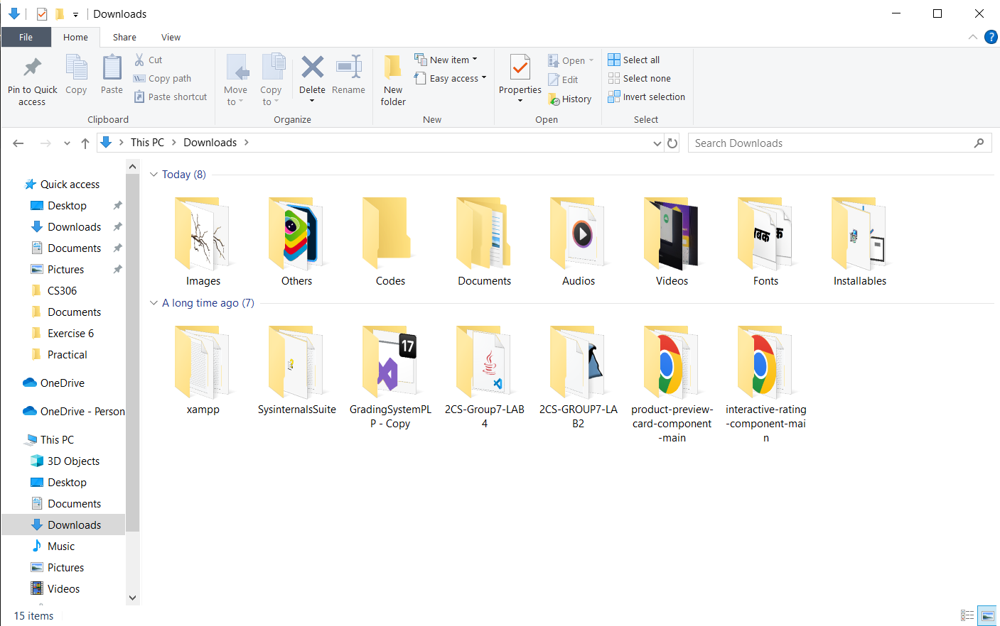
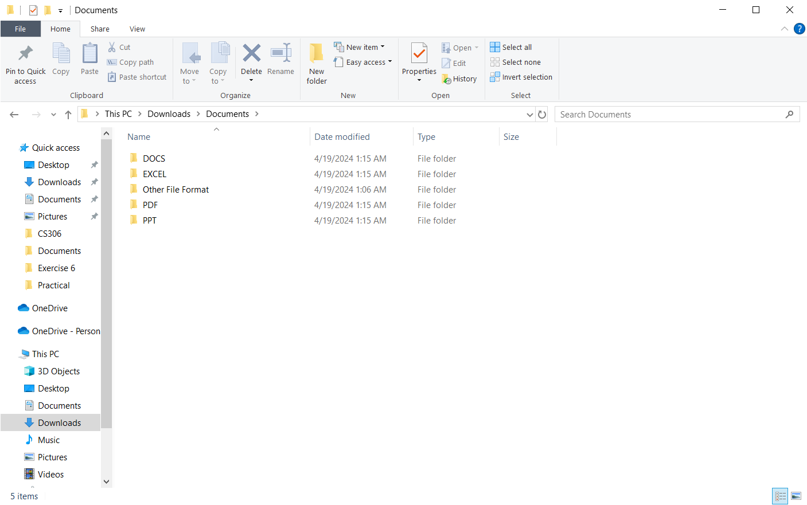
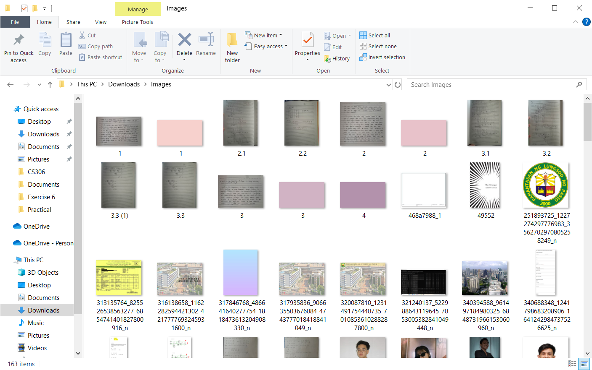
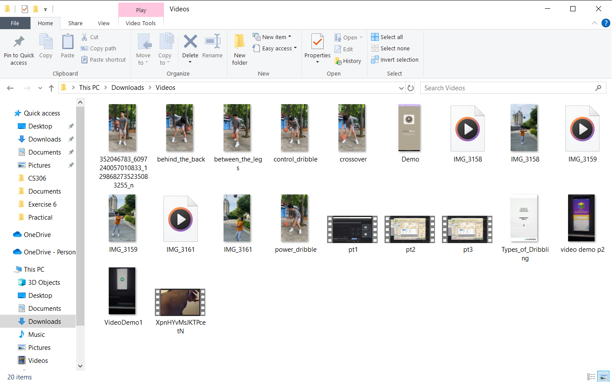

# File Organizer
This project automates the organization of files within the Downloads, Documents, and Desktop directories by categorizing them into their respective folders based on file types. By streamlining this process, it effectively reduces clutter and chaoticness, resulting in a more organized and cleaner directory.

## Features
- Automatically sorts files into their designated folders.
- Supports various file types such as images, videos, documents, audios, and more.

## Demo
> The following screenshots will show how the script organizes the files into their respective folders based on their file types.

*Downloads*

*Downloads/Documents*

*Downloads/Images*

*Downloads/Videos*

### NOTE:
While the current implementation effectively organizes files, this is just a quick project meant to solve the problem that I'm currently experiencing. For that reason, there may be opportunities for improvement or alternative approaches. Feel free to explore and enhance the functionality to make it even better.